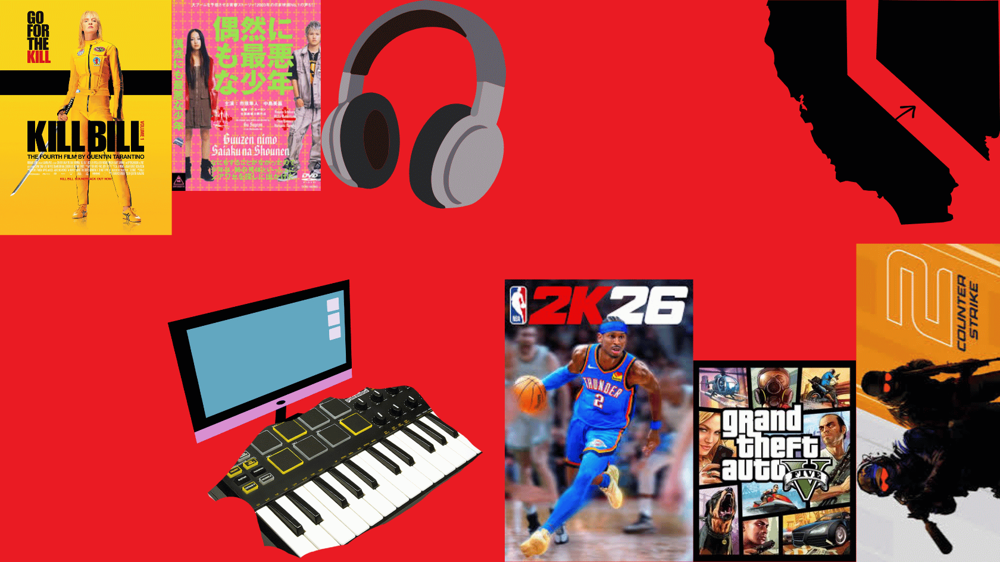

# liam-in-markdown-1 
Dear Mr. Aiello,
My name is **Liam** **Hudson** and I am in **10th** grade at **Chatsworth Charter High School**. I currently do not have a favorite book, but I do have a couple of favorite movies, including *Kill Bill*, *Worst by Chance*, and *Schindler's List*. Over the summer, I have learned a couple of new skills, such as chipping in golf, being able to touch my toes, and I recently was able to solve a Rubix Cube! A fun fact about me is that I am able to type pretty fast in my opinion, with a peak of 150 wpm one time. 

I have a couple goals for this school year, to get at least a 3.5 GPA or even better, straight A's! I want to keep my friends and hope nothing bad happens to my friendships/relationships. This year I have gotten a lot better at playing golf, which I am proud of. 

This year, I want to start producing music, but I do need to save up a lot of money for the DAW I want, $180 specifically. We don't really have much family traditions, but we do go up to **Las Vegas** every month or two. This summer, I hung out with my friends a lot, going **bowling**, playing **golf**, and just spending time with them!
From, Liam Hudson 
Period 2

[Playlist For Mr. Aiello](https://open.spotify.com/playlist/6u6OXIRuhMN3iWsvm4rIiT?si=YXhYdqLVRlSOrtv_BYPJpg)

